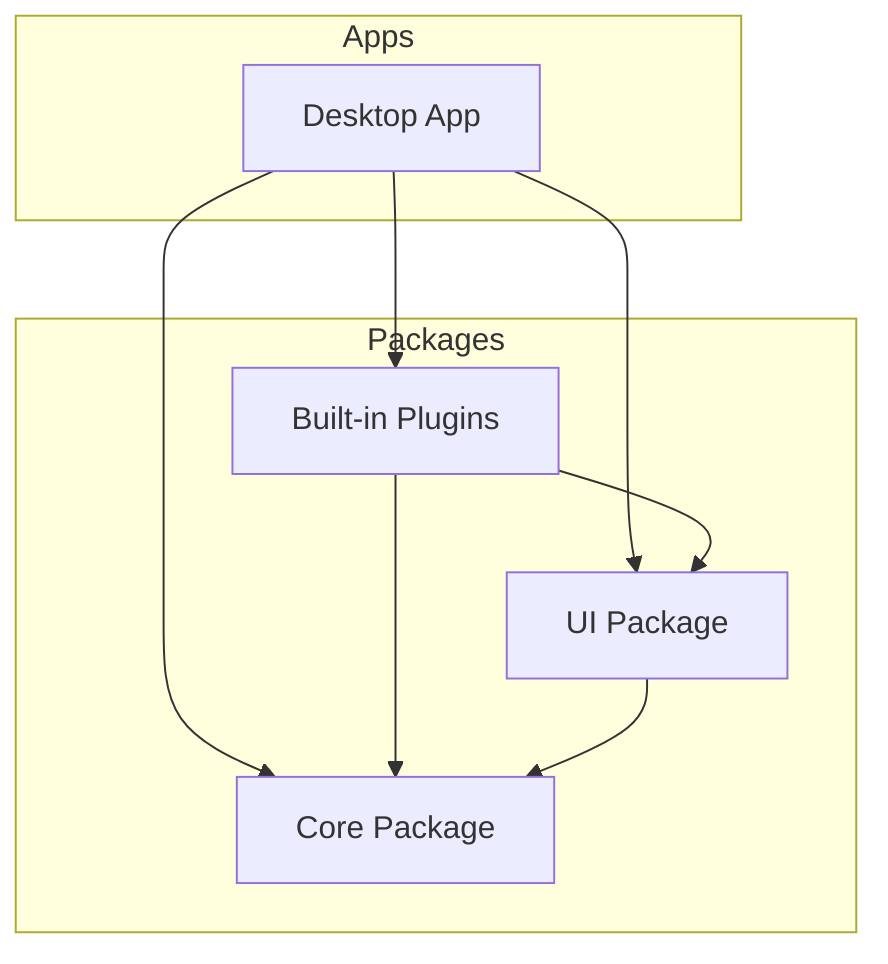
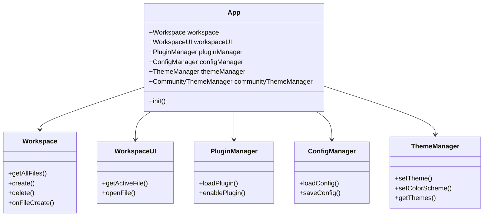

# Inkdown Architecture Overview

Inkdown is a modern, cross-platform markdown note-taking application built with **Tauri**, **React**, and **TypeScript**. It follows a modular architecture, separating the core logic, UI components, and plugins.

## High-Level Architecture

The application is divided into three main layers:

1.  **Apps Layer (`apps/`)**: The entry point for different platforms (currently Desktop). Handles platform-specific initialization and layout.
2.  **Core Layer (`packages/core/`)**: The heart of the application. Contains the business logic, state management, and the Plugin API.
3.  **UI Layer (`packages/ui/`)**: A shared component library ensuring design consistency across the application and plugins.
4.  **Plugins Layer (`packages/plugins/`)**: Built-in plugins that provide core functionality (e.g., File Explorer, Search).

---

## Core System (`@inkdown/core`)

The Core package is the foundation of Inkdown. It exposes the main `App` class and various Managers that handle specific domains.

### Key Components

*   **App**: The central hub. Initializes managers and coordinates the application lifecycle.
*   **Workspace**: Manages file operations (create, read, update, delete) and file events. It acts as the "Vault".
*   **WorkspaceUI**: Manages the visual state, including tabs, views, and the active file.
*   **PluginManager**: Handles loading, enabling, and disabling plugins.
*   **FileSystemManager**: A bridge to the Rust backend for file system operations.
*   **EditorRegistry**: Manages editor instances and allows plugins to interact with the active editor.
*   **ConfigManager**: Handles persistent configuration storage (JSON files in app config directory).
*   **ThemeManager**: Manages theme loading, switching, and CSS injection for both built-in and custom themes.
*   **CommunityThemeManager**: Handles browsing, installing, and managing community themes from GitHub.

### Data Flow

1.  **Initialization**: `App` initializes all managers.
2.  **File Operations**: `Workspace` uses `FileSystemManager` to talk to the backend.
3.  **UI Updates**: `WorkspaceUI` listens to `Workspace` events and updates the React state.
4.  **Plugins**: Plugins interact with `App` to register commands, views, and settings.
5.  **Themes**: `ThemeManager` loads theme preferences from `ConfigManager` and applies CSS.

## Related Documentation

- [Editor Architecture](./editor.md)
- [Theme System](./theme-system.md)
- [Configuration System](./config-system.md)
- [Plugin System](../plugins/system.md)
- [CSS Architecture](../styling/css-architecture.md)
