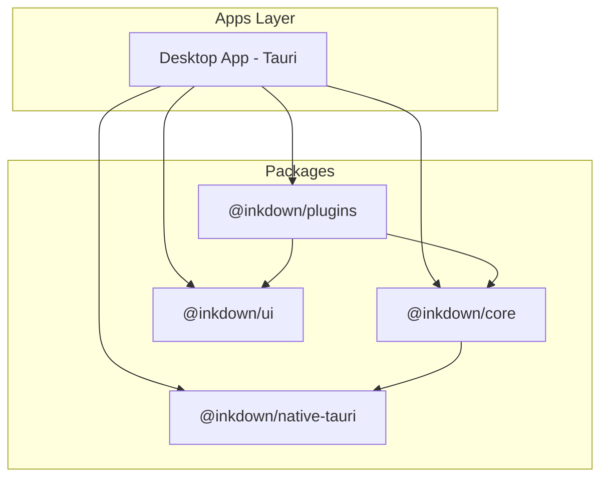
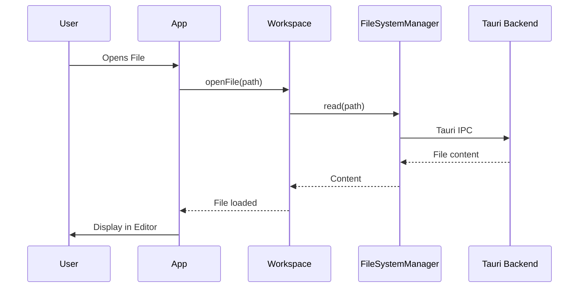
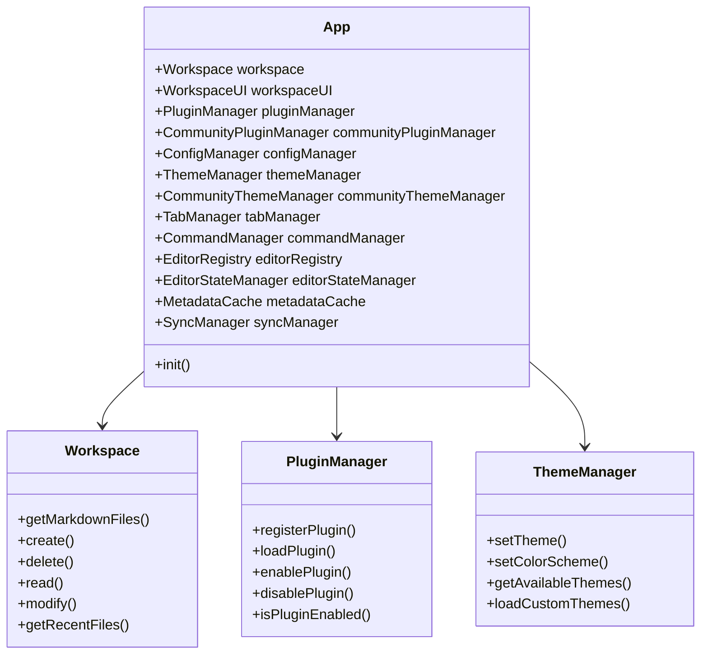

# Inkdown Architecture Overview

Inkdown is a modern, cross-platform markdown note-taking application built with **Tauri v2**, **React 19**, and **TypeScript**. It follows a modular monorepo architecture, separating core logic, UI components, native bindings, and plugins.

## High-Level Architecture

The application is organized as a Bun monorepo with the following structure:

1. **Apps Layer (`apps/`)**: Platform-specific entry points. Currently includes the Desktop app using Tauri.
2. **Core Layer (`packages/core/`)**: The heart of the application. Contains business logic, state management, managers, and the Plugin API.
3. **UI Layer (`packages/ui/`)**: Shared React component library for design consistency.
4. **Plugins Layer (`packages/plugins/`)**: Built-in plugins providing core functionality.
5. **Native Layer (`packages/native-tauri/`)**: Tauri-specific native bindings for file system, dialogs, clipboard, etc.



---

## Core System (`@inkdown/core`)

The Core package is the foundation of Inkdown. It exposes the main `App` class and various Managers that handle specific domains.

### Key Managers

| Manager | Description |
|---------|-------------|
| **App** | Central hub that initializes all managers and coordinates the application lifecycle |
| **Workspace** | Manages file operations (CRUD) and file events. Acts as the "Vault" |
| **WorkspaceUI** | Manages UI state including tabs, views, and active file |
| **PluginManager** | Handles built-in plugin loading, enabling, and disabling |
| **CommunityPluginManager** | Handles community plugin discovery, installation, and updates from GitHub |
| **ConfigManager** | Persistent configuration storage (JSON files in app config directory) |
| **ThemeManager** | Theme loading, switching, and CSS injection for built-in themes |
| **CommunityThemeManager** | Community theme browsing, installation, and management from GitHub |
| **FileSystemManager** | Bridge to the Rust backend for file system operations |
| **EditorRegistry** | Manages CodeMirror editor instances and provides access to active editor |
| **EditorStateManager** | Manages content of open files, dirty states, and auto-saving |
| **TabManager** | Handles tab management, restoration, and persistence |
| **CommandManager** | Central registry for all commands (plugin and built-in) |
| **MetadataCache** | Caches file metadata and frontmatter for quick access |
| **SyncManager** | Handles workspace synchronization |
| **BookmarkManager** | Manages bookmarked files |
| **FontManager** | System font discovery and management |

### Initialization Flow

```typescript
// App initialization order (simplified from App.ts)
async init(): Promise<void> {
    // 1. Initialize config manager (needed by other managers)
    await this.configManager.init();
    
    // 2. Load system fonts
    await this.fontManager.loadSystemFonts();
    
    // 3. Load and apply theme
    await this.loadTheme();
    
    // 4. Initialize community theme manager
    await this.communityThemeManager.init();
    
    // 5. Initialize sync manager
    await this.syncManager.init();
    
    // 6. Initialize bookmark manager
    await this.bookmarkManager.initialize();
    
    // 7. Initialize community plugin manager and load plugins
    await this.communityPluginManager.init();
    await this.communityPluginManager.loadAllInstalledPlugins();
    
    // 8. Load all plugins (built-in + community)
    await this.loadPlugins();
    
    // 9. Initialize tab manager and restore tabs
    await this.tabManager.init();
}
```

### Data Flow



### Class Diagram



## Technology Stack

| Component | Technology |
|-----------|------------|
| Desktop Framework | Tauri v2 (Rust backend) |
| Frontend | React 19 + TypeScript |
| Editor | CodeMirror 6 |
| Styling | CSS Variables (no Tailwind) |
| Package Manager | Bun |
| Build Tool | Vite |
| Linting | Biome |

## Related Documentation

- [Editor Architecture](./editor.md)
- [Theme System](./theme-system.md)
- [Configuration System](./config-system.md)
- [Plugin System](../plugins/system.md)
- [CSS Architecture](../styling/css-architecture.md)
