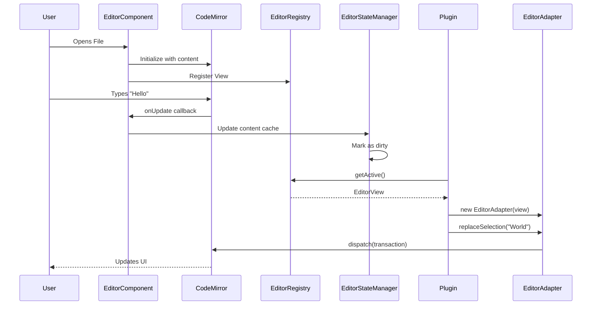

# Editor Architecture

The editor is the core component of Inkdown, built on top of **CodeMirror 6**. It provides a robust, extensible, and performant editing experience for Markdown.

## Architecture

The editor architecture abstracts CodeMirror internals from the rest of the application and plugins, providing a stable API.

### Key Components

| Component | Description |
|-----------|-------------|
| **Editor Component** (`Editor.tsx`) | React component that renders CodeMirror. Handles lifecycle, resizing, and configuration |
| **EditorAdapter** | Wrapper around CodeMirror `EditorView` implementing the `Editor` interface for plugins |
| **EditorRegistry** | Central registry tracking all active editor instances. Provides access to active editor |
| **EditorStateManager** | Manages content of open files, dirty states (unsaved changes), caching, and auto-saving |

### EditorAdapter API

The `EditorAdapter` class provides a simplified API for plugins to interact with the editor:

```typescript
import { EditorAdapter } from '@inkdown/core';

// Get the active editor
const activeEditor = app.editorRegistry.getActive();
if (activeEditor) {
    const adapter = new EditorAdapter(activeEditor);
    
    // Get content
    const content = adapter.getValue();
    
    // Get/set selection
    const selection = adapter.getSelection();
    adapter.replaceSelection('New text');
    
    // Get cursor position
    const cursor = adapter.getCursor();
    
    // Set cursor position
    adapter.setCursor({ line: 10, ch: 0 });
}
```

### Data Flow



## Editor Modes

The editor supports three display modes, controlled via CSS classes:

| Mode | Description |
|------|-------------|
| **Editor Only** | Shows only the markdown editor |
| **Preview Only** | Shows only the rendered markdown preview |
| **Side-by-Side** | Shows both editor and preview side-by-side |

## Live Preview

Inkdown implements a "Live Preview" experience where markdown syntax is rendered directly in the editor. This is achieved through CodeMirror extensions (ViewPlugins and StateFields) that decorate the editor content.

### Live Preview Features

- **Bold/Italic**: `**text**` and `*text*` are rendered as formatted text
- **Headings**: `#` markers are hidden, text is sized appropriately
- **Links**: Rendered as clickable widgets with hidden syntax
- **Inline Code**: Backticks are hidden, code is styled
- **Lists**: Styled markers replace raw `-` or `*`
- **Blockquotes**: `>` markers hidden, styled quote block shown
- **Selection-aware**: Syntax is revealed when cursor is inside the element
- **Viewport-optimized**: Only visible content is decorated for performance

### Live Preview Plugin

The Live Preview functionality is implemented as a built-in plugin (`live-preview`). The extension is integrated directly into the Editor component, which checks if the plugin is enabled before applying decorations:

```typescript
// The editor checks plugin status
if (app.pluginManager.isPluginEnabled('live-preview')) {
    // Apply live preview extensions
}
```

## Extending the Editor

Plugins can extend the editor using CodeMirror extensions:

```typescript
import { keymap } from '@codemirror/view';

class MyPlugin extends Plugin {
    async onload() {
        // Register a custom keybinding
        this.registerEditorExtension(
            keymap.of([{
                key: 'Ctrl-k',
                run: () => {
                    console.log('Custom key pressed');
                    return true;
                }
            }])
        );
    }
}
```

## Related Documentation

- [Architecture Overview](./README.md)
- [Plugin System](../plugins/system.md)
