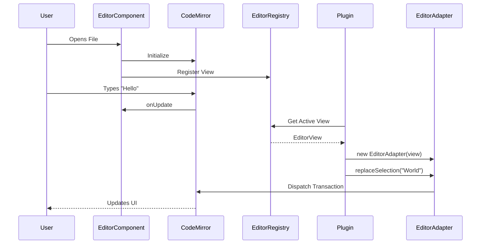

# Editor Architecture

The editor is a core component of Inkdown, built on top of **CodeMirror 6**. It provides a robust, extensible, and performant editing experience.

## Architecture

The editor architecture is designed to abstract CodeMirror internals from the rest of the application and plugins, providing a stable API.

### Key Components

1.  **Editor Component (`Editor.tsx`)**: The React component that renders the CodeMirror instance. It handles lifecycle, resizing, and initial configuration.
2.  **EditorAdapter**: A wrapper around the CodeMirror `EditorView`. It implements the `Editor` interface, providing a safe and simplified API for plugins to interact with the editor (e.g., `getSelection`, `replaceSelection`).
3.  **EditorRegistry**: A central registry that keeps track of all active editor instances. It allows the `Workspace` to retrieve the active editor and expose it to plugins.
4.  **EditorStateManager**: Manages the content of open files, handling caching, dirty states (unsaved changes), and auto-saving.

### Data Flow

1.  **Rendering**: `Editor.tsx` initializes CodeMirror.
2.  **Registration**: On mount, `Editor.tsx` registers the CodeMirror view with `EditorRegistry`.
3.  **Interaction**:
    *   **User**: Types in the editor -> CodeMirror updates state -> `onUpdate` callback triggers -> `EditorStateManager` updates content cache.
    *   **Plugin**: Accesses `app.workspace.activeEditor` -> Gets `EditorAdapter` -> Calls `replaceSelection()` -> Adapter dispatches CodeMirror transaction.

## Editor Modes

The editor supports three display modes, handled by CSS classes in `EditorModes.css`:

1.  **Editor Only**: Shows only the markdown editor.
2.  **Preview Only**: Shows only the rendered markdown preview.
3.  **Side-by-Side**: Shows both editor and preview side-by-side.

## Live Preview

Inkdown aims to implement a "Live Preview" experience where markdown syntax is rendered directly in the editor (e.g., bold text is bold, headers are larger). This is achieved through CodeMirror extensions (ViewPlugins and StateFields) that decorate the editor content.
