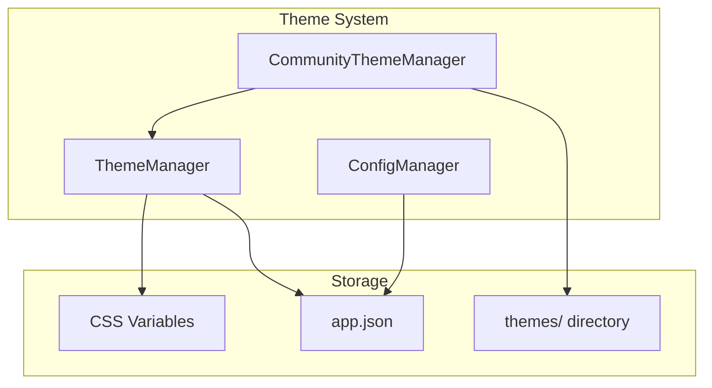
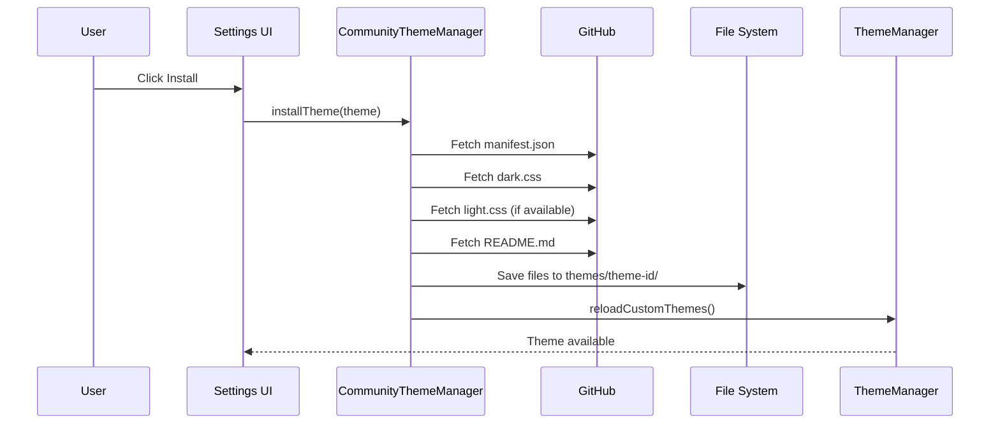

# Theme System

Inkdown features a comprehensive theme system that supports both built-in and custom/community themes. This document describes the architecture and implementation details.

## Overview

The theme system consists of three main components:

1. **ThemeManager**: Manages theme loading, switching, and CSS injection for built-in and custom themes
2. **CommunityThemeManager**: Handles browsing, installing, and managing community themes from GitHub
3. **ConfigManager**: Persists theme preferences and installed theme metadata



## ThemeManager

The `ThemeManager` class (`packages/core/src/ThemeManager.ts`) is responsible for:

- Registering built-in themes (default-dark, default-light)
- Loading custom themes from the themes directory
- Applying themes by setting CSS classes or injecting custom CSS
- Managing color scheme (dark/light) switching
- Persisting theme preferences to configuration

### Initialization Flow

```typescript
async init(): Promise<void> {
    // 1. Register built-in themes
    this.registerBuiltInThemes();
    
    // 2. Load custom themes from disk
    await this.loadCustomThemes();
    
    // 3. Load saved preference from config
    const config = await this.app.configManager.loadConfig('app');
    this.colorScheme = config?.colorScheme || 'dark';
    this.currentTheme = config?.theme || 'default-dark';
    
    // 4. Apply the theme
    this.applyColorScheme(this.colorScheme);
}
```

### Theme Application

**Built-in Themes**: Use CSS classes (`.theme-dark`, `.theme-light`) already loaded in the app's CSS bundle:

```typescript
// Simply swap the class on documentElement
document.documentElement.className = 'theme-dark';
```

**Custom Themes**: CSS is fetched from the theme directory and injected into a `<style>` element:

```typescript
private applyCustomThemeCSS(cssContent: string): void {
    // Remove any existing custom theme
    const existing = document.getElementById('inkdown-custom-theme');
    if (existing) existing.remove();
    
    // Inject new theme CSS
    const styleElement = document.createElement('style');
    styleElement.id = 'inkdown-custom-theme';
    styleElement.textContent = cssContent;
    document.head.appendChild(styleElement);
}
```

### Color Scheme Switching

```typescript
// Switch to dark mode
await themeManager.setColorScheme('dark');

// Switch to light mode
await themeManager.setColorScheme('light');

// Get current scheme
const scheme = themeManager.getColorScheme(); // 'dark' | 'light'
```

When switching between modes:
1. For built-in themes: Swap the CSS class on `documentElement`
2. For custom themes with both modes: Load the appropriate CSS file (`dark.css` or `light.css`)

## CommunityThemeManager

The `CommunityThemeManager` class (`packages/core/src/CommunityThemeManager.ts`) handles community themes from GitHub:

### Features

| Feature | Description |
|---------|-------------|
| Browse Themes | Fetches theme listings from the community registry |
| Caching | In-memory cache with 1-hour TTL |
| Install/Uninstall | Downloads and saves theme files locally |
| Version Tracking | Tracks installed versions for update detection |

### Theme Installation Flow



### Cache Strategy

```typescript
interface CommunityThemeCache {
    lastFetched: number;                      // Timestamp for TTL check
    listings: CommunityThemeListing[];        // Basic theme info from registry
    themes: Record<string, CommunityTheme>;   // Full theme details (on-demand)
}
```

- **TTL**: 1 hour (configurable via `CACHE_TTL` constant)
- **Invalidation**: Manual refresh or automatic on TTL expiry
- **Storage**: In-memory only (not persisted between sessions)

## Theme File Structure

Custom themes are stored in the app's config directory:

```
~/Library/Application Support/com.furqas.inkdown/themes/
└── theme-name/
    ├── manifest.json    # Theme metadata (required)
    ├── dark.css         # Dark mode styles (required if modes includes 'dark')
    ├── light.css        # Light mode styles (optional)
    └── README.md        # Theme documentation (optional)
```

### manifest.json

```json
{
  "name": "My Theme",
  "author": "Author Name",
  "version": "1.0.0",
  "description": "A beautiful custom theme",
  "homepage": "https://github.com/author/my-theme",
  "modes": ["dark", "light"]
}
```

| Field | Required | Description |
|-------|----------|-------------|
| `name` | Yes | Display name shown in theme browser |
| `author` | Yes | Theme author's name |
| `version` | Yes | Semantic version (e.g., "1.0.0") |
| `description` | No | Brief description of the theme |
| `homepage` | No | URL to theme repository or website |
| `modes` | Yes | Supported modes: `["dark"]`, `["light"]`, or `["dark", "light"]` |

### CSS Files

Theme CSS must use the appropriate class selector and define CSS variables:

```css
/* dark.css */
.theme-dark {
    /* Background Colors */
    --bg-primary: #1d2021;
    --bg-secondary: #282828;
    --bg-sidebar: #1f2335;
    --bg-tertiary: #32302f;

    /* Text Colors */
    --text-primary: #ebdbb2;
    --text-secondary: #d5c4a1;
    --text-muted: #928374;

    /* Accent Colors */
    --color-primary: #fe8019;
    --color-primary-hover: #fabd2f;
    --color-success: #b8bb26;
    --color-warning: #fabd2f;
    --color-danger: #fb4934;
    
    /* ... all other variables ... */
}
```

## TypeScript Types

### ThemeConfig

Runtime representation of a theme:

```typescript
interface ThemeConfig {
    id: string;           // Theme directory name
    name: string;         // Display name
    author?: string;
    version?: string;
    description?: string;
    homepage?: string;
    modes: ColorScheme[]; // ['dark'] | ['light'] | ['dark', 'light']
    builtIn?: boolean;    // true for default themes
}
```

### ColorScheme

```typescript
type ColorScheme = 'dark' | 'light';
```

### CommunityThemeListing

From the community registry index:

```typescript
interface CommunityThemeListing {
    id: string;           // Unique identifier
    name: string;         // Display name
    author: string;       // Author name
    repo: string;         // GitHub repo (e.g., "author/repo")
    branch?: string;      // Branch name (default: "main")
    modes: ColorScheme[]; // Supported modes
}
```

## Tauri Commands

The theme system uses Tauri commands for file operations:

| Command | Description |
|---------|-------------|
| `list_custom_themes` | Lists all theme directories in themes/ |
| `read_theme_manifest` | Reads a theme's manifest.json |
| `read_theme_css` | Reads a theme's CSS file |
| `install_community_theme_file` | Saves a file to themes/theme-id/ |
| `uninstall_community_theme` | Removes a theme directory |

## Related Documentation

- [Creating Themes](../styling/creating-themes.md)
- [CSS Architecture](../styling/css-architecture.md)
- [Configuration System](./config-system.md)
