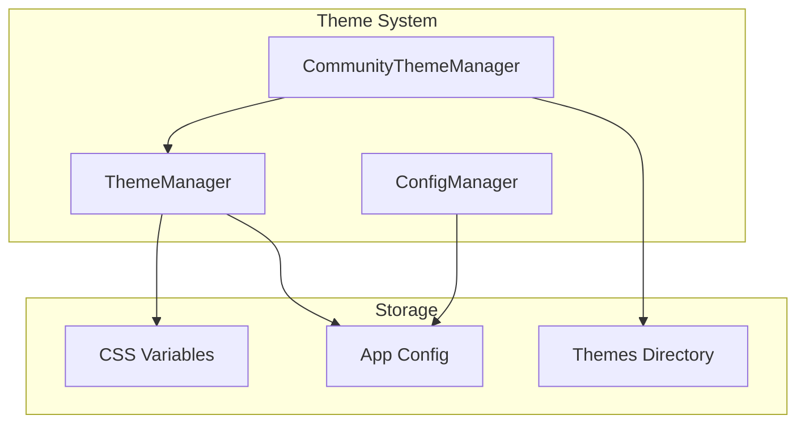
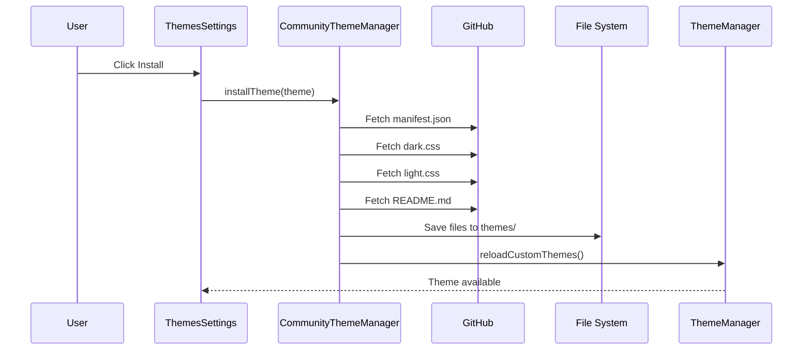

# Theme System

Inkdown features a comprehensive theme system that supports both built-in and custom themes. This document describes the architecture and implementation of the theming system.

## Overview

The theme system consists of three main components:

1. **ThemeManager**: Manages theme loading, switching, and CSS injection
2. **CommunityThemeManager**: Handles browsing, installing, and managing community themes
3. **ConfigManager**: Persists theme preferences and installed theme metadata



## ThemeManager

The `ThemeManager` class (`packages/core/src/ThemeManager.ts`) is responsible for:

- Registering built-in themes (default-dark, default-light)
- Loading custom themes from the themes directory
- Applying themes by injecting CSS into the document
- Managing color scheme (dark/light) switching
- Persisting theme preferences

### Theme Loading Flow

1. **Initialization**: `ThemeManager.init()` is called during app startup
2. **Register Built-in**: Built-in themes are registered in memory
3. **Load Custom**: Custom themes are loaded by reading `manifest.json` files from the themes directory
4. **Apply Theme**: The saved theme preference is loaded and applied

### Applying Themes

**Built-in Themes**: Use CSS classes (`.theme-dark`, `.theme-light`) already loaded in the app's CSS bundle.

**Custom Themes**: CSS is fetched from the theme directory and injected into a `<style>` element in the document head.

```typescript
// ThemeManager applies custom theme CSS
private applyCustomThemeCSS(cssContent: string): void {
    const styleElement = document.createElement('style');
    styleElement.id = 'inkdown-custom-theme';
    styleElement.textContent = cssContent;
    document.head.appendChild(styleElement);
}
```

### Color Scheme Switching

When switching between dark/light modes:

1. For built-in themes: Simply swap the CSS class on `documentElement`
2. For custom themes with both modes: Load the appropriate CSS file (`dark.css` or `light.css`)

```typescript
await themeManager.setColorScheme('dark');  // Switches to dark mode
await themeManager.setColorScheme('light'); // Switches to light mode
```

## CommunityThemeManager

The `CommunityThemeManager` class (`packages/core/src/CommunityThemeManager.ts`) handles community themes:

### Features

- **Browse Themes**: Fetches theme listings from the community repository
- **Caching**: Caches theme data in memory with a 1-hour TTL
- **Install/Uninstall**: Downloads and saves theme files to the local config directory
- **Version Tracking**: Tracks installed versions for update detection

### Theme Installation Flow



### Cache Strategy

```typescript
interface CommunityThemeCache {
    lastFetched: number;           // Timestamp for TTL check
    listings: CommunityThemeListing[];  // Basic theme info
    themes: Record<string, CommunityTheme>;  // Full theme details
}
```

- **TTL**: 1 hour (configurable via `CACHE_TTL` constant)
- **Invalidation**: Manual refresh or automatic on TTL expiry
- **Storage**: In-memory only (not persisted between sessions)

## Theme File Structure

Custom themes are stored in the app's config directory:

```
~/Library/Application Support/com.furqas.inkdown/themes/
└── theme-name/
    ├── manifest.json    # Theme metadata
    ├── dark.css         # Dark mode styles
    ├── light.css        # Light mode styles (optional)
    └── README.md        # Theme documentation (optional)
```

### manifest.json

The manifest file contains theme metadata:

```json
{
  "name": "Theme Name",
  "author": "Author Name",
  "version": "1.0.0",
  "description": "A description of the theme",
  "homepage": "https://github.com/author/theme",
  "modes": ["dark", "light"]
}
```

| Field | Required | Description |
|-------|----------|-------------|
| `name` | Yes | Display name of the theme |
| `author` | Yes | Theme author's name |
| `version` | Yes | Semantic version (e.g., "1.0.0") |
| `description` | No | Brief description |
| `homepage` | No | URL to theme repository or website |
| `modes` | Yes | Array of supported modes: `["dark"]`, `["light"]`, or `["dark", "light"]` |

### CSS Files

Theme CSS files must use the `.theme-dark` or `.theme-light` class selector and define CSS variables:

```css
/* dark.css */
.theme-dark {
    /* Background Colors */
    --bg-primary: #1d2021;
    --bg-secondary: #282828;
    --bg-sidebar: #282828;
    --bg-tertiary: #32302f;

    /* Text Colors */
    --text-primary: #ebdbb2;
    --text-secondary: #d5c4a1;
    --text-muted: #928374;

    /* ... more variables */
}
```

## TypeScript Types

### ThemeConfig

Runtime representation of a theme:

```typescript
interface ThemeConfig {
    id: string;           // Theme directory name
    name: string;         // Display name
    author?: string;
    version?: string;
    description?: string;
    homepage?: string;
    modes: ColorScheme[]; // ['dark'] | ['light'] | ['dark', 'light']
    builtIn?: boolean;    // true for default themes
}
```

### CommunityTheme

Full community theme data:

```typescript
interface CommunityTheme {
    listing: CommunityThemeListing;  // From themes.json index
    manifest: CommunityThemeManifest; // From manifest.json
    readme: string;                   // README.md content
    screenshotUrl: string;            // Resolved screenshot URL
    installed: boolean;
    installedVersion?: string;
}
```

## Rust Backend Commands

The theme system uses Tauri commands for file operations:

| Command | Description |
|---------|-------------|
| `list_custom_themes` | Lists all theme directories |
| `read_theme_manifest` | Reads a theme's manifest.json |
| `read_theme_css` | Reads a theme's CSS file (dark.css/light.css) |
| `install_community_theme_file` | Saves a file to the themes directory |
| `uninstall_community_theme` | Removes a theme directory |

## Creating a Custom Theme

1. Create a new directory in the themes folder
2. Create `manifest.json` with required metadata
3. Create `dark.css` and/or `light.css` with CSS variables
4. Optionally add a `README.md`

See the [CSS Architecture](../styling/css-architecture.md) document for the full list of CSS variables.
