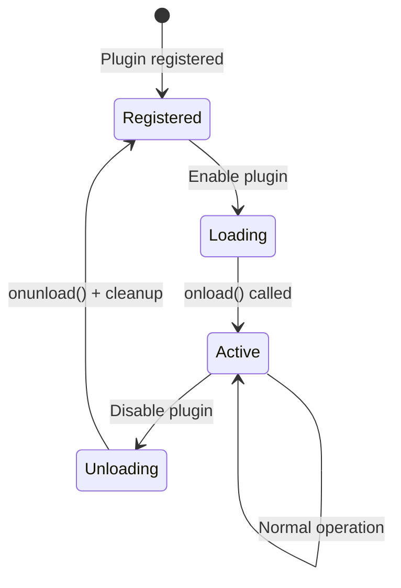

# Plugin System

Inkdown features a powerful plugin system that allows developers to extend the application's functionality. The system is designed to be modular, type-safe, and compatible with the Obsidian plugin API patterns.

## Plugin Structure

A plugin is a class that extends the base `Plugin` class from `@inkdown/core`. Each plugin requires a manifest file and implements the `onload()` and `onunload()` lifecycle methods.

### Basic Plugin

```typescript
import { Plugin } from '@inkdown/core';

export default class MyPlugin extends Plugin {
    async onload() {
        console.log('MyPlugin loaded');
        
        // Register commands, settings, views, etc.
        this.addCommand({
            id: 'my-command',
            name: 'My Command',
            callback: () => console.log('Command executed')
        });
    }

    async onunload() {
        console.log('MyPlugin unloaded');
        // Resources are automatically cleaned up
    }
}
```

### Plugin Manifest

Each plugin requires a `manifest.json`:

```json
{
    "id": "my-plugin",
    "name": "My Plugin",
    "version": "1.0.0",
    "minAppVersion": "0.1.0",
    "description": "A sample plugin for Inkdown",
    "author": "Your Name",
    "authorUrl": "https://github.com/yourusername"
}
```

## Plugin Capabilities

### 1. Commands

Register commands accessible via the Command Palette or keyboard shortcuts:

```typescript
this.addCommand({
    id: 'show-greeting',
    name: 'Show Greeting',
    hotkey: ['Mod', 'Shift', 'g'],  // Cmd/Ctrl + Shift + G
    callback: () => {
        this.showNotice('Hello from plugin!');
    }
});
```

### 2. Settings

Add a settings tab to the Settings modal:

```typescript
import { PluginSettingTab, Setting } from '@inkdown/core';

class MySettingTab extends PluginSettingTab {
    plugin: MyPlugin;
    
    constructor(app: App, plugin: MyPlugin) {
        super(app, plugin);
        this.plugin = plugin;
    }
    
    display(): void {
        const { containerEl } = this;
        containerEl.empty();
        
        new Setting(containerEl)
            .setName('Enable Feature')
            .setDesc('Toggle this feature on or off')
            .addToggle(toggle => toggle
                .setValue(this.plugin.settings.enabled)
                .onChange(async (value) => {
                    this.plugin.settings.enabled = value;
                    await this.plugin.saveSettings();
                }));
    }
}

// In onload()
this.addSettingTab(new MySettingTab(this.app, this));
```

### 3. Editor Interaction

Interact with the active editor using `EditorAdapter`:

```typescript
import { EditorAdapter } from '@inkdown/core';

// Get active editor
const activeEditor = this.app.editorRegistry.getActive();
if (activeEditor) {
    const editor = new EditorAdapter(activeEditor);
    
    // Get content
    const content = editor.getValue();
    
    // Replace selection
    editor.replaceSelection('Inserted text');
    
    // Get cursor position
    const cursor = editor.getCursor();
}
```

### 4. Status Bar

Add items to the status bar:

```typescript
const statusBarItem = this.addStatusBarItem();
statusBarItem.setText('Word count: 0');

// Update later
statusBarItem.setText('Word count: 150');
```

### 5. Editor Suggestions (Autocomplete)

Register custom autocomplete providers:

```typescript
import { EditorSuggest } from '@inkdown/core';

class MySuggest extends EditorSuggest<MyItem> {
    onTrigger(cursor, editor, file) {
        // Return trigger info or null
    }
    
    getSuggestions(context) {
        // Return array of suggestions
    }
    
    renderSuggestion(item, el) {
        // Render suggestion item
    }
    
    selectSuggestion(item, evt) {
        // Handle selection
    }
}

// In onload()
this.registerEditorSuggest(new MySuggest(this.app));
```

### 6. Markdown Processing

Register custom code block processors:

```typescript
this.registerMarkdownCodeBlockProcessor('mermaid', (source, el, ctx) => {
    // Render mermaid diagram
    el.innerHTML = renderMermaid(source);
});
```

Register post-processors for rendered markdown:

```typescript
this.registerMarkdownPostProcessor((el, ctx) => {
    // Process all links
    el.querySelectorAll('a').forEach(link => {
        link.addEventListener('click', handleClick);
    });
});
```

### 7. Custom Styles

Inject CSS that's automatically removed on unload:

```typescript
this.addStyle(`
    .my-custom-class {
        color: var(--text-accent);
        background: var(--bg-secondary);
    }
`);
```

### 8. CodeMirror Extensions

Register CodeMirror extensions for custom editor behavior:

```typescript
import { keymap } from '@codemirror/view';

this.registerEditorExtension(
    keymap.of([{
        key: 'Ctrl-k',
        run: () => {
            console.log('Custom shortcut');
            return true;
        }
    }])
);
```

### 9. Notices (Toast Notifications)

Show temporary notifications:

```typescript
// Simple notice (auto-hides after 5 seconds)
this.showNotice('File saved!');

// Custom duration
this.showNotice('Processing...', 3000);

// Persistent notice with manual control
const notice = this.showNotice('Uploading...', 0);
// Later...
notice.hide();
```

### 10. Data Persistence

Load and save plugin data:

```typescript
interface MySettings {
    option1: string;
    enabled: boolean;
}

const DEFAULT_SETTINGS: MySettings = {
    option1: 'default',
    enabled: true
};

// In onload()
async loadSettings() {
    this.settings = { ...DEFAULT_SETTINGS, ...await this.loadData() };
}

async saveSettings() {
    await this.saveData(this.settings);
}
```

## Plugin Lifecycle



1. **Registered**: Plugin manifest is loaded, plugin is available but not active
2. **Loading**: Plugin class is instantiated
3. **Active**: `onload()` is called, plugin is fully functional
4. **Unloading**: `onunload()` is called, then automatic cleanup of:
   - Commands
   - Settings tabs
   - Status bar items
   - Event listeners
   - Editor suggests
   - Injected styles
   - Markdown processors

## Built-in vs Community Plugins

| Type | Location | Default State | Management |
|------|----------|---------------|------------|
| **Built-in** | `packages/plugins/` | Enabled by default | `PluginManager` |
| **Community** | `~/Library/.../plugins/` | Disabled by default | `CommunityPluginManager` |

Built-in plugins are bundled with the app and provide core functionality. Community plugins are installed from GitHub and loaded dynamically.

## Related Documentation

- [Community Plugins](./community-plugins.md)
- [UI Components](./ui-components.md)
- [Built-in Plugins](../built-in-plugins.md)
